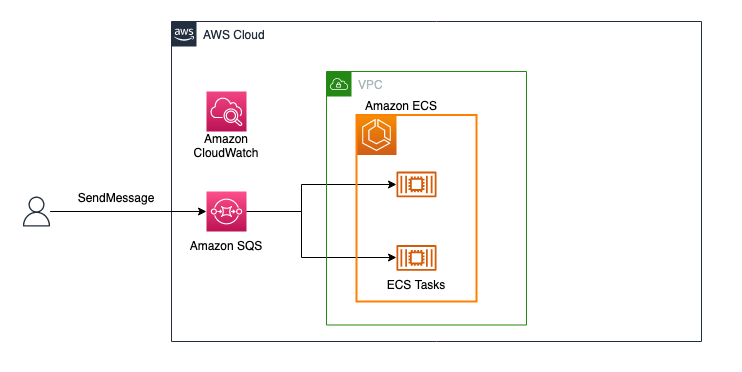

ECS Service scaling based on SQS messages

<p align="center">
    
</p>

Rust application in Amazon ECS tasks polls SQS queue and the application scales based on CloudWatch metrics (NumberOfMessagesVisible).

## How to deploy

Run the followings.

```shell
npm install
cdk deploy
```

Send some messages to SQS queue, and you will see ECS tasks scale out.
